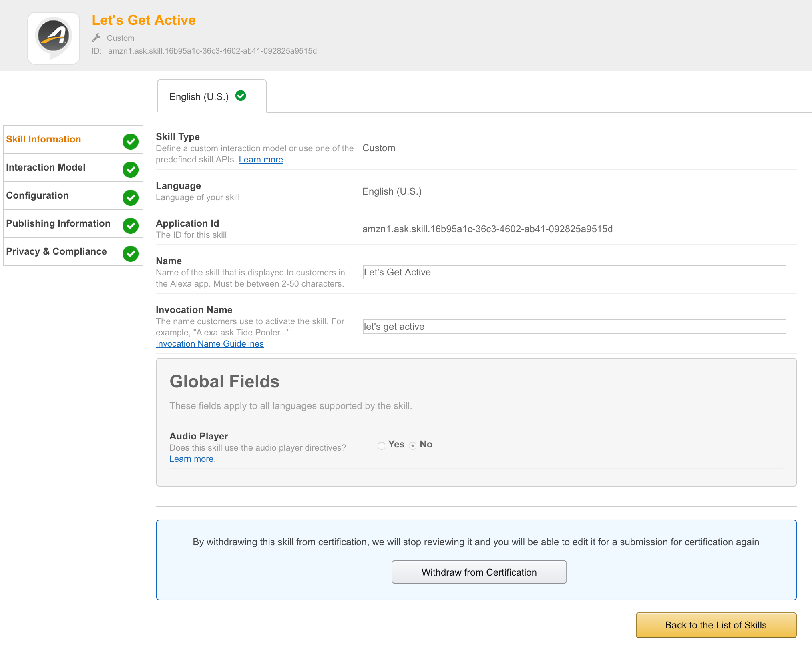
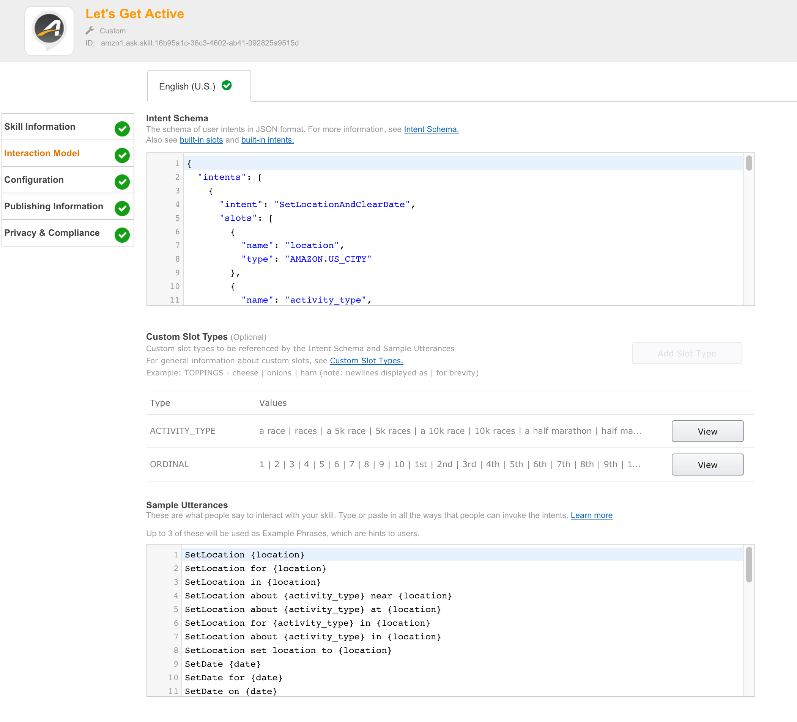
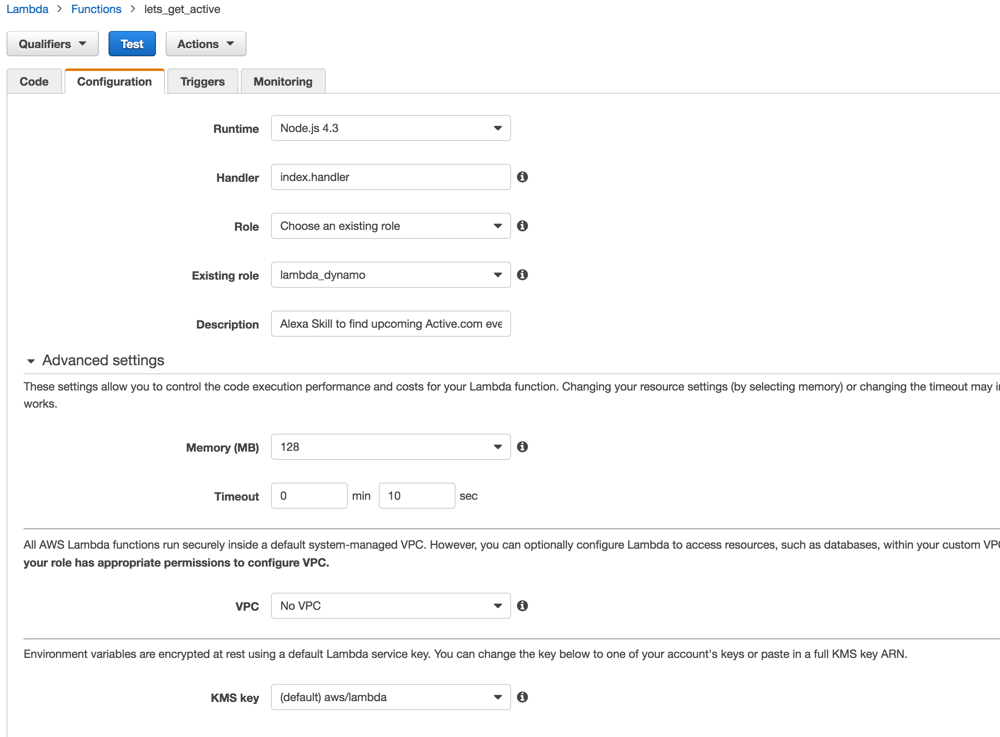

# lets-get-active
An active lifestyle keeps you both healthy and happy... or so they say ;) Now you can use Alexa on an Amazon echo device to find out information about upcoming races and Active.com events. Try it out! "Alexa, open Let's get active!"

This Alexa Skill prompts you to enter a location and optionally a starting date and it will search for the most popular running races that meet your criteria. Whether you are getting ready to jog your first 5k, you are an avid 10k/half-marathon runner, or you've got a few marathon's under your belt. And for any couch-potatoes out there, there are even some short 1K and 1 mile races. Whatever your motivation, just get out there and get moving! 

Your race awaits you!

Sample converation:
* You: "Alexa, ask Let's get active to find upcoming 5k races near Marietta, GA"
* Alexa: "OK, I found 81 events within 25 miles of Marietta, GA starting Monday, November 28th or later. Would you like to hear about them?"
* You: "Sure!"
* Alexa: Here are the 3 most popular events. 
    * \#1 is the Run the Lights of Life 5K/1K Presented by Life University on Saturday, December 3rd at Life University. 
    * \#2 is the Dashing Through The Square 5K Walk/Run on Saturday December 3rd at Marietta Square.
    * \#3 is the The Ugly Sweater Run Atlanta on Saturday December 10th, at Piedmont Park.
* You: Tell me about \#4.
* Alexa: Event number 4 is the POLAR BEAR RUN on Saturday, January 28th, located at Johnson Ferry Baptist Church.
* You: Give me more details about that one.
* Alexa: Sure, I've sent a card to your Alexa app where you can get more information and register.
...

## Here are some of the interesting user-facing features and notes about the skill:
* Looks for events near any US location on or after a specified date
* The skill remembers your preferences (like the last search location) to make it quicker to search next time
* Intelligent ranking algorithm recommends events based upon a combination of popularity, date and proximity.
* Provides summary information about the top-3 events and allows users to navigate through additional events.
* Users can ask for more details about any event and receive a card on their phone with information and a shortened link to  register for the event.
* Information card displays the race/event logo if available 

## Here are some of the interesting developer notes/features of the skill:
* Uses the Active.com API to query for events
* The skill makes use of multiples states to give context sensitivity to the conversation
* The skill persists select information for future use so that users can get updates more easily
* Persists race logos to S3 with public-read ACL permissions and the proper Content-Type to handle CORS/HTTPS limitations of the original site hosting the images.
* Makes use of the bitly url shortener to mitigate the non-clickable links limitation in the Alexa app. (Please, oh please enable links for certified/white-listed applications).
* Makes use of a forked/patched version of the Alexa Skills Kit SDK for node.js [https://github.com/pmarkert/alexa-skills-kit-sdk-for-nodejs](https://github.com/pmarkert/alexa-skills-kit-sdk-for-nodejs). I have submitted a [pull-request](https://github.com/alexa/alexa-skills-kit-sdk-for-nodejs/pull/40) to have my changes incorporated into the original project.
    * Fixed defect with missing reprompt text being rendered by Alexa and prompting users with "undefined".
    * Missing documentation in README about DynamoDB Table requirements
    * Other minor documentation edits
* During the development of this skill, I also developed and published a helpful unit-testing framework [https://github.com/pmarkert/alexa-skill-tester](https://github.com/pmarkert/alexa-skill-tester). The framework uses collection of .json files to invoke the skill handler and then validates the responses against matching .response.json files.
    * Provides unit-test coverage capability to test every available intent against each of the states
    * Supports automatic re-generation of expected response values
* Used mock elements to substitute for real API calls to keep unit tests portable, fast, and avoid authentication issues.

## alexa-skill-tester
I wanted a way to easily test my skill and nail down the expected responses. There are a lot of intents, combinations of values for slots, and states that can be managed, so it is difficult/impossible to manually test every possible combination each time a change is made. Additionally, the JSON for the Alexa Skill requests/responses can be rather verbose, so I wanted an easy way to manage the test-cases using standard files. During the development of Alexa Skills, I have found that there are often surprises with the way that Alexa fills in the intents and slots. I wanted an easy way that each time my skill received a request that caused a failure, that I could 

the exact request content from the CloudWatch logs, save it as a new test-case, verify/reproduce the issue locally, and then once repaired, lock in the expected response.

During the development process, I found myself making a lot of small changes to the response text, such as adding/removing punctuation and optimizing the specific words for the spoken audio. The smallest change in the response text causes unit-test failures (by intention), but I wanted an easy way to update the response files. Also, in some cases, it is too time-consuming to type-out what the expected response from a skill interaction should be. In these cases, the alexa-skill-tester that I developed allows a flag to be set as an environment variable. If the flag is set then the test will write-back the response files (if they did not already exist). This makes it easy to do mass update and then let git tell me exactly what changed in the resposnes.

## Stub/mock elements
During the unit tests, I did not want the tests to make outbound API calls. Outbound calls have a few problems when it comes to unit testing. For one thing, they greatly slow down the tests. Ideally every hundred unit tests should be able to run in less than one or two seconds. Another problem is that some of the services that are called require specific API keys or credentials, which I obviously do not want to check-in. Other developers would not be able to run the same tests because they would fail to make the API calls. Because of this, I setup two mock objects for my project. One is the stub object that replaces the Active.com API during tests. To solve this, I had a subdirectory under the ./tests/responses folder where static response files can be stored. Whenever the mock-instance of the request library is used, instead of making the actual HTTP call to retrieve the data, it calculates a checksum of the URL and loads the contents from a file in the responses directory named by the checksum of the URL value. This has the added benefit that if any unexpected URLs are requested, the tests will fail quickly. To populate the values, after determining the failed mock API call, I would download the proper response from the real API and save it into the folder under the check-summed filename. 

I also made a mock instance of the bitly service for url-shortening. This one does not load any actual values, but just returns a dummy response each time.

## alexa-skills-kit-sdk-for-nodejs improvements
I used the alexa-skills-kit-sdk-for-nodejs SDK to do the development of this skill. I had written my own similar framework called [Wavelength](https://github.com/pmarkert/wavelength) over a year ago before there were any other solid frameworks to do lambda-based skill development. One feature that I had not finished adding to the Wavelength project was the ability to easily manage dynamic states. Now that the Amazon team has published an official SDK, I decided to take it for a roll with this skill. I did find quite a few small surprises with the SDK. Some of it was related to small documentation challenges, but one bug (in my opinion) that I found was that when submitting an ":ask" response that did not specifically include a reprompt value (which is documented as optional), The SDK wouldn't detect that a reprompt was missing and it would serialize the response with a reprompt value of "undefined". Needless to say, this caused me some surprise when I was first testing my skill and when I wanted to wait for the skill to time out, a few seconds later, Alexa says "Undefined!". :) Here is the [pull-request](https://github.com/alexa/alexa-skills-kit-sdk-for-nodejs/pull/40) that I submitted for this issue.

## Dynamic loading of states
I used the "enum-like" module that I created to distinguish the states to dynamically iterate each state and find/load the corresponding handlers module and load it in automatically. This way, I don't have to remember to go and register each new state.

## Components and libraries used
**To run the skill in production, I used the following packages:**
* alexa-sdk - the router/response framework
* aws-sdk - for reading/writing the logo images to S3
* bitly - for shortening the registration urls
* lodash - for the sorting and some utility methods
* moment - for date manipulation, parsing, and formatting

**For unit-testing, packaging, deployment and running the skill locally, I also used the following packages:**
* alexa-skill-tester - The package I created to do the unit testing (originally this was in the project and it got refactored out after some of the other developers expressed an interest in the technique).
* grunt and grunt-aws-lambda - Packaging and deployment
* mocha - unit testing framework
* chai - assertion framework
* async - For triggering multiple tests asynchronously
* aws-lambda-mock-context - A local mock of the lambda context to hook into the handler.

# Step-by-step
1. I applied for an API key with the Active.com developer network. http://developer.active.com/ They had shutdown new applications to their search API, however after I sent them an email, they were kind enough to provide me with a key. This key is stored as an environment variable in AWS Lambda, encrypted at rest with my KMS keys.
2. Created a new skill entry in my Alexa developer portal specifying the name of my skill and the invocation name. The description, language, logo, and country availability. This generates a new skill/application Id for the skill. 

3. Next I created my Intent Schema. The Intent Schema defines which interactions make use of what variables (slots) and the types for those slot values. The final contents of my intent schema are also stored in the source-code repository under [doc/intent_schema.json](doc/intent_schema.json). This schema evolves over time as new features and capabilities are added to the skill.

4. After creating the intent schema, I needed to define the values for the custom slot types. These are the possible word combinations that can be fit into that specific slot. Those are available in [doc/ordinal.slot_type](doc/ordinal.slot_type) and [doc/activity_type.slot_type](doc/activity_type.slot_type). The Ordinal slot type was to allow users to enter numbers or ordinal values for jumping to a spot in the listings. The activity_type slot_type is not currently being used, but in the future it will be used to further refine the types of races that are sought out by the skill. For example, the races can be limited to "5K" or "half-marathon" races. The main purpose of this activity_type slot right now is that it let's me provide more language examples without having to explode the number of sample utterances.
5. After the slot_types were defined, the sample utterances are the next step. [doc/sample_utterances.txt](doc/sample_utterances.txt). The sample utterances describe for each intent-type some possible grammars/sentence structures that can be used to invoke the intent and the corresponding slot values.
6. Next I created an S3 bucket to host the image. "s3://lets-get-active".
7. Next I created a new AWS Lambda function to host the skill. I called my function "lets-get-active" and selected the Node.js runtime. I used the smallest memory setting.

8. I configured the identity role to have permissions to read/write to dynamo and also to be able to write and set ACL permissions for objects in the lets-get-active bucket. 
9. I also told Lambda that Alexa Skills Kit was going to be the trigger for the function.

10. I set the environment variables for my Lambda function for the secret API keys for my Bitly API account and the Active.com API. These keys are encrypted at rest using the Amazon Key Management Service. The keys should never be hard-coded or checked into source-code. In my local environment, I usually keep a ./tmp folder (that is added to .git_ignore) to keep secrets, scratch-work, and other files that I do not want to accidentally commit.

11. Once the function was created, I started working on a new node package. I initialized a .git repository, used npm init to setup the package.json, and made use of grunt and grunt-aws-lambda packages to prepare and deploy my function. 
12. I created a DynamoDB table to store the attribute data. I did not see anywhere in the documentation for the alexa-sdk what the name of the primary key was supposed to be, so I looked into the src code for the library to find that it was expecting the primary key to be "userId". I added this information to the README.md and added it to the pull-request mentioned above. I added the name of the dynamo table as one of the environment variables for my Lambda function.

